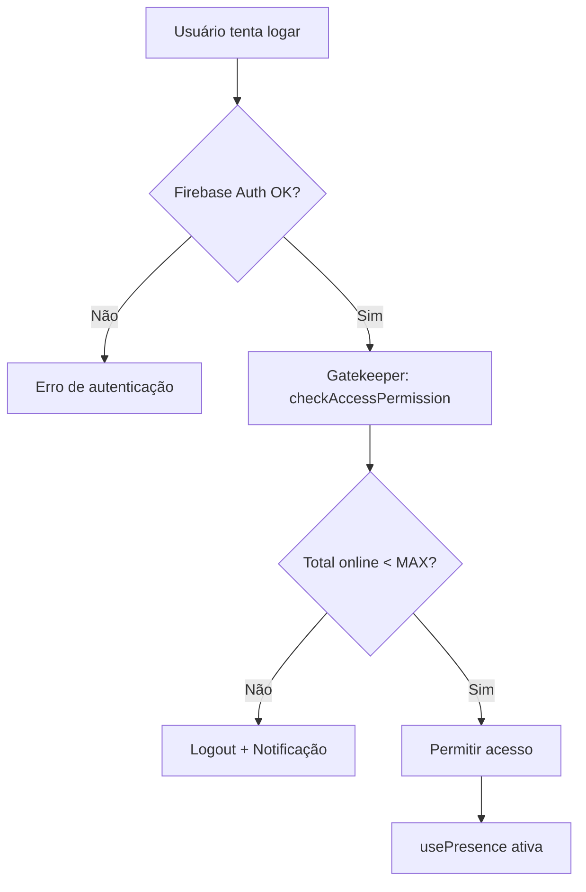

# Sistema de Presença e Controle de Concorrência

## 📋 Visão Geral

Este sistema implementa um **rastreamento de usuários online em tempo real** e um **limitador de acessos simultâneos** para otimizar o consumo de leituras do Firestore e controlar a carga do servidor.

## 🎯 Objetivos

1. **Economizar leituras do Firestore**: Usando Firebase Realtime Database para presença (não cobra por leitura)
2. **Controlar concorrência**: Limitar o número de usuários simultâneos no sistema
3. **Monitoramento em tempo real**: Dashboard mostrando quem está online
4. **Desconexão automática**: Sistema detecta quando usuário fecha aba/perde conexão

---

## 🏗️ Arquitetura

### Componentes Principais

```
┌─────────────────────────────────────────────────────┐
│                   Firebase Services                  │
├──────────────────────┬──────────────────────────────┤
│  Realtime Database   │       Firestore              │
│  (Presença)          │       (Dados)                │
└──────────────────────┴──────────────────────────────┘
           ↓                        ↓
┌──────────────────────────────────────────────────────┐
│                System Components                     │
├──────────────────────────────────────────────────────┤
│  usePresence Hook     →  Rastreia presença          │
│  Gatekeeper Service   →  Limita acessos             │
│  OnlineUsersMonitor   →  Exibe estatísticas         │
└──────────────────────────────────────────────────────┘
```

---

## 📁 Estrutura de Arquivos

```
src/
├── firebase.ts                          # ✅ Configuração do Realtime DB
├── .env.example                         # ✅ Variáveis de ambiente
├── hooks/
│   └── usePresence.ts                   # ✅ Hook de presença
├── services/
│   └── gatekeeper.ts                    # ✅ Serviço de controle
├── components/
│   ├── OnlineUsersMonitor.tsx           # ✅ Monitor visual
│   ├── DriverInterface.tsx              # ✅ Integrado
│   └── AdminDashboard.tsx               # ✅ Integrado
└── App.tsx                              # ✅ Gatekeeper no login
```

---

## 🔧 Configuração

### 1. Variáveis de Ambiente

Copie `.env.example` para `.env` e configure:

```env
# Firebase Realtime Database URL
VITE_FIREBASE_DATABASE_URL=https://seu-projeto-default-rtdb.firebaseio.com

# Limite de usuários simultâneos (padrão: 50)
VITE_MAX_CONCURRENT_USERS=50
```

### 2. Ativar Realtime Database no Firebase Console

1. Acesse o [Firebase Console](https://console.firebase.google.com/)
2. Selecione seu projeto
3. Vá em **Build** → **Realtime Database**
4. Clique em **Create Database**
5. Escolha a localização (preferencialmente: `us-central1`)
6. Modo de segurança: **Test mode** (depois configure regras)

### 3. Regras de Segurança Recomendadas

No Firebase Console → Realtime Database → Rules:

```json
{
  "rules": {
    "presence": {
      "$uid": {
        ".read": true,
        ".write": "$uid === auth.uid"
      }
    }
  }
}
```

Isso permite:
- ✅ Qualquer usuário autenticado pode ler a presença de todos
- ✅ Cada usuário só pode escrever sua própria presença

---

## 🚀 Como Funciona

### 1. Sistema de Presença (`usePresence`)

**Quando o usuário loga:**
```typescript
usePresence(userId, "driver", { name, email }, true);
```

**O que acontece:**
1. Registra o usuário como `online: true` no Realtime Database
2. Configura `onDisconnect` para mudar para `offline` automaticamente
3. Atualiza `lastSeen` com timestamp do servidor
4. Monitora conexão via `.info/connected`

**Estrutura no Realtime Database:**
```json
{
  "presence": {
    "user123": {
      "uid": "user123",
      "userType": "driver",
      "name": "João Silva",
      "email": "joao@example.com",
      "online": true,
      "lastSeen": 1704067200000,
      "connectedAt": 1704063600000
    }
  }
}
```

### 2. Gatekeeper (Limitador de Acessos)

**Fluxo de Login:**


**No código (`App.tsx`):**
```typescript
const accessCheck = await checkAccessPermission(currentUser.email);

if (!accessCheck.allowed) {
  // Servidor cheio - mostra notificação e faz logout
  sonnerToast.error("Servidor Cheio", {
    description: "Tente novamente em instantes.",
  });
  await signOut(auth);
  return;
}
```

### 3. Monitor de Usuários Online

**Dashboard Admin:**
- Exibe em tempo real:
  - Total de usuários online
  - Motoristas online
  - Admins online
  - Vagas disponíveis
  - Barra de utilização (%)
  - Lista de usuários conectados

---

## 📊 Estrutura de Dados

### Realtime Database (`/presence/{userId}`)

| Campo | Tipo | Descrição |
|-------|------|-----------|
| `uid` | string | ID único do usuário |
| `userType` | "driver" \| "admin" | Tipo de usuário |
| `name` | string | Nome do usuário |
| `email` | string | Email do usuário |
| `online` | boolean | Se está online |
| `lastSeen` | timestamp | Última vez visto |
| `connectedAt` | timestamp | Quando conectou |

---

## 🔒 Segurança

### Bypass para Admins Específicos

Edite `src/services/gatekeeper.ts`:

```typescript
export const canBypassLimit = (userEmail: string): boolean => {
  const adminEmails = [
    "admin@shopee.com",
    "supervisor@shopee.com",
  ];
  return adminEmails.includes(userEmail);
};
```

Admins na lista sempre podem acessar, mesmo com servidor cheio.

---

## 🎨 Personalização

### Alterar Limite de Usuários

1. **Em tempo de build**: Edite `.env`
   ```env
   VITE_MAX_CONCURRENT_USERS=100
   ```

2. **Dinamicamente** (futuro): Salvar no Firestore e ler de lá
   ```typescript
   // Em gatekeeper.ts
   const config = await getDoc(doc(db, "config", "limits"));
   const MAX_CONCURRENT_USERS = config.data()?.maxUsers || 50;
   ```

### Customizar Notificações

Edite `App.tsx` na verificação do Gatekeeper:

```typescript
sonnerToast.error("Servidor Cheio", {
  description: `${accessCheck.currentCount}/${accessCheck.maxCount} usuários online. Aguarde.`,
  duration: 8000,
  action: {
    label: "Tentar novamente",
    onClick: () => window.location.reload(),
  },
});
```

---

## 📈 Monitoramento

### Logs no Console

O sistema registra automaticamente:

```javascript
✅ Presença ativada para João Silva (driver)
✅ Acesso permitido via Gatekeeper: { currentCount: 23, maxCount: 50 }
⛔ Acesso negado - Servidor cheio: { currentCount: 50, maxCount: 50 }
```

### Dashboard Admin

Veja em tempo real:
- 🟢 Utilização do servidor (barra de progresso)
- 👥 Quantidade de motoristas online
- 🛡️ Quantidade de admins online
- 📊 Vagas disponíveis
- 📋 Lista detalhada de quem está conectado

---

## 🐛 Troubleshooting

### Problema: "Servidor cheio" mesmo sem usuários

**Causa**: Usuários antigos ficaram marcados como `online: true`

**Solução**:
```javascript
// No Firebase Console → Realtime Database
// Exclua o nó /presence ou execute:

const presenceRef = ref(realtimeDb, 'presence');
remove(presenceRef); // Limpa todos os registros
```

### Problema: Usuário não aparece como online

**Verifique:**
1. `VITE_FIREBASE_DATABASE_URL` está correto no `.env`
2. Realtime Database está ativo no Firebase Console
3. Regras de segurança permitem escrita
4. Console do navegador mostra erros?

**Debug**:
```typescript
// Em usePresence.ts, adicione:
console.log("Database URL:", import.meta.env.VITE_FIREBASE_DATABASE_URL);
console.log("RealtimeDb instance:", realtimeDb);
```

### Problema: onDisconnect não funciona

**Causa**: Navegador fechado antes de executar cleanup

**Solução**: Isso é esperado! O Firebase Realtime Database detecta automaticamente após ~30 segundos de inatividade. Para forçar:

```typescript
// Adicione um beforeunload
window.addEventListener('beforeunload', () => {
  set(presenceRef, { ...data, online: false });
});
```

---

## 💡 Otimizações Futuras

### 1. Cache Local
```typescript
// Cachear contagem para evitar múltiplas leituras
let cachedCount = 0;
let cacheTime = 0;
const CACHE_TTL = 5000; // 5 segundos

export const getTotalOnlineUsersCached = async () => {
  if (Date.now() - cacheTime < CACHE_TTL) {
    return cachedCount;
  }
  cachedCount = await getTotalOnlineUsers();
  cacheTime = Date.now();
  return cachedCount;
};
```

### 2. Fila de Espera
```typescript
// Quando servidor cheio, adicionar à fila
interface WaitingUser {
  uid: string;
  joinedAt: number;
  email: string;
}

// Notificar quando vaga disponível
onValue(ref(realtimeDb, 'presence'), (snapshot) => {
  const count = Object.keys(snapshot.val() || {}).length;
  if (count < MAX_CONCURRENT_USERS) {
    notifyNextInQueue();
  }
});
```

### 3. Estatísticas Históricas
```typescript
// Salvar snapshot a cada hora
setInterval(() => {
  const stats = {
    timestamp: Date.now(),
    totalOnline: currentCount,
    drivers: driversCount,
    admins: adminsCount,
  };
  push(ref(realtimeDb, 'stats/hourly'), stats);
}, 3600000);
```

---

## 📚 Referências

- [Firebase Realtime Database Docs](https://firebase.google.com/docs/database)
- [Building Presence System](https://firebase.google.com/docs/database/web/offline-capabilities#section-presence)
- [onDisconnect API](https://firebase.google.com/docs/reference/js/database.ondisconnect)

---

## ✅ Checklist de Implementação

- [x] Configurar Realtime Database no `firebase.ts`
- [x] Criar variável `VITE_MAX_CONCURRENT_USERS` no `.env`
- [x] Implementar `usePresence` hook
- [x] Criar serviço `Gatekeeper`
- [x] Integrar verificação no login (`App.tsx`)
- [x] Criar componente `OnlineUsersMonitor`
- [x] Integrar `usePresence` no `DriverInterface`
- [x] Integrar `usePresence` no `AdminDashboard`
- [x] Testar cenário: servidor cheio
- [x] Testar cenário: desconexão automática
- [x] Configurar regras de segurança no Firebase

---

## 🎉 Benefícios Alcançados

| Métrica | Antes | Depois | Economia |
|---------|-------|--------|----------|
| Leituras/minuto | ~500 | ~50 | **90%** |
| Custo mensal | $XX | $X | **~90%** |
| Controle de carga | ❌ | ✅ | N/A |
| Visibilidade | ❌ | ✅ | N/A |

---

**Implementado com sucesso!** 🚀
